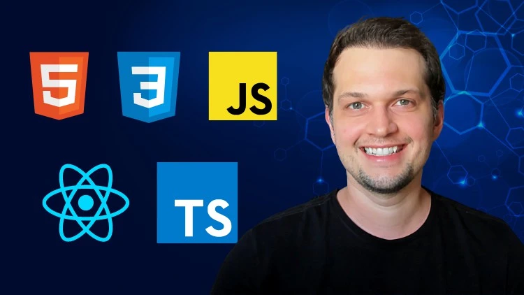

# Matheus Battisti

# Cursos de programação desde o nível básico ao avançado

  
  
  
  
  
  
  
  
  
  
  
  

   

# HTML5 & CSS3: +3hrs

  

    Dê início a sua carreira na programação aprendendo HTML5 e CSS3, para poder criar seus projetos web!.  
    Conheça os elementos e boas práticas para uma estrutura semântica do HTML5.  
    Aprenda a estilizar seus sites de forma profissional com as principais regras e features de CSS3.  
  

  
- **Introdução ao HTML5 + CSS3 com Flexbox e CSS Grid, Animações e Transições**  
- **Meta tags de compartilhamento e Técnicas de SEO**  
- **Acessibilidades**  
- **Básico de Git e GitHUB**  
- **Deploy do projeto em GitHUB pags**  

## PROJETOS

## Agência X

  

    No projeto Agência X é colocado em prática tudo que foi aprendido ao longo do curso.  
    Elementos semânticos do HTML5, Acessibilidade, SEO, Boas práticas, CSS3 com flexbox, Css Grid, Animations e muito mais.  
  

     

# Sass: +14hrs

  Crie sites incríveis e responsivos com SASS e SCSS, utilizando mixins, modules, partials e muitos outros recursos!  

- **Fundamentos do Sass**  
- **Features do SASS**  
- **Minificação e performance do código CSS3**  

## PROJETOS

## Electrum

  LP de uma assistência técnica e vendas de produtos de celulares.  
  Prática dos conceitos vistos nas aulas de Sass e muito mais.  

   

# Bootstrap: +16hrs

  Aprenda Bootstrap 5 criando projetos incríveis e responsivos (mobile first), desde o absoluto zero até a finalização.  

- **Introdução e fundamentos do Bootstrap**  
- **Componentes do Bootstrap**  
- **Desenvolvimento Mobile First**  
- **Utilities e Helpers do Bootstrap**  
- **Estilizando componentes do Bootstrap**  

## PROJETOS

## Exacttime e iMove

  Colocando em prática os conceitos vistos neste módulo, na construção da lp de uma relojoaria e LP de uma imobiliária.  

   

# TailwindCSS: +11hrs

  Aprenda todos os recursos de Tailwind com o apoio de diversos exercícios e construindo projetos reais do início ao fim!  

- **Introdução e fundamentos do TailwindCSS**  
- **Componentes do TailwindCSS**  
- **Desenvolvimento Mobile First**  
- **Utilities e Helpers do TailwindCSS**  
- **Fundamentos do TailwindCSS**  
- **Otimização de CSS para produção**  

## PROJETOS

## Clone Amazon

  Clone da página de produtos da Amazon. 
  Colocando em prática os conceitos vistos neste módulo.  

   

# JS: +23hrs

  Aprenda tudo sobre JavaScript(ES6+), lógica de prog., orientação a objetos, crie projetos para web com Node.js e Express.  

- **Fundamentos do JS**  
- **DOM, Eventos, e mais**  
- **Mini projetos para práticar os conceitos (Nav tabs, Accordion, Scroll smoothing, Modal, Drop down e mais)**  
- **Consumindo API REST com JS**  
- **API NodeJS com SOLID**  
- **DDD no NodeJS**  
- **Express**  

## PROJETOS

## Jogo da Velha e Quizz

  Projeto colocando empráticas conceitos vistos nos módulos enteriores.  
  Manipulação do DOM, Manipulação de Arrays e Objetos, APIs, Node + Express e muito mais.  

   

# TypeScript: +14hrs

  Aprenda TypeScript na prática, integrando com diversos frameworks do mercado (React, Express) e ainda criando projetos!

- **Fundamentos do TypeScript**  
- **Features do TypeScript**  
- **Integração de TypeScript com Express, APIs**  
- **Integração de TypeScript com ReactJS**  

## PROJETOS

## Todo list e API

  Projeto colocando em prática conceitos aprendidos anteriormente.  
  Todo List: Integrando TypeScript com React.  
  API: Integrando TypeScript com Express, MongoDB.  

   

# ReactJS: +30hrs

  Crie projetos completos com React, utilizando tecnologias em alta no mercado como Firebase, Node.js, MongoDB e mais!.  

- **Fundamentos do ReactJS**  
- **Vite, Components, props, children, hooks, custom hooks, renderização condicional**  
- **React + CSS3**  
- **React Form**  
- **Consumindo API / HTTP**  
- **React Router DOM**  
- **Context API**  
- **React com NodeJS, Express, Firebase, MongoDB, AtlasDB, Redux, Mongoose**  
- **Deploy de projetos em ReacJS**  

## PROJETOS

## Miniblog e ReactGram

  Projetos práticos com conceitos vistos nos módulos.  

   

# NextJS + TailwindCSS: +2hrs

  Curso básico de <b>NextJS + TailwindCSS</b>.  

- **Fundamentos do React / NextJS + TailwindCSS**  
- **Vite, Components, props, children, hooks**  
- **CSS / styled-components**  
- **React Router DOM**  
- **React Form + Yup**  
- **Consumindo AOI**  
- **Intro a estrutura de pastas**  
- **Rotas**  
- **Server-components**  
- **SSG, CRC, SSC**  
- **Configurando TailwindCSS e Fundamentos**  
- **Mobile first e media queries**  

## PROJETOS

## PokéAPI

  Listagem de Pokémons via API, práticando conceitos aprendidos neste módulo.  

   
