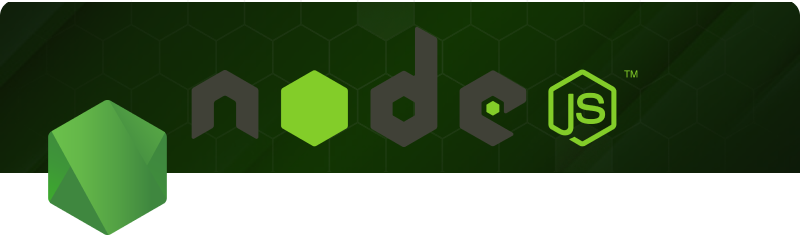
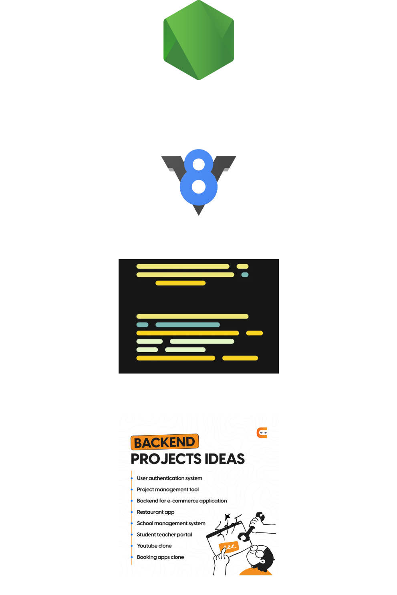

# NodeJS

  
O que é NodeJS

  É um ambiente que utiliza <b>V8 Engine</b> para executar aplicações back-end em JavaScript no server-side.  
  Como: Envio de email, conexões a banco de dados, web sever, api, chatbots, e muito mais.  
  <a href="https://nodejs.org/en/download/prebuilt-installer"><b>Download NodeJS</b></a>
  

 

  
O que é NPM - Node Package Manager

  É um gerenciador de pacotes do NodeJS. Possibilita instalar, atualizar e remover pacotes nos projetos.  
  <b>package.json:</b> É um arquivo que guarda informações do projeto como:  
  - Nome, autor, versão, pacotes/módulos necessários para o funcionamento do projeto.  
  Permite executar determinados scripts nos projetos.  

Comando para iniciar um projeto em NodeJS:  

  <pre>
    <code>
      npm init -y
    </code>
  </pre>

Comando para instalar pacote local:  

  <pre>
    <code>
      npm i name_package
    </code>
  </pre>

Comando para instalar pacote de desenvolvimento:  

  <pre>
    <code>
      npm i -D name_package
    </code>
  </pre>

 

  
O que são módulos

  São conjuntos de códigos e funções "empacotados". Ou seja são scripts reaproveitáveis e precisam ser exportados (module.exports) e importados (require) onde necessário.  
  São divididos em 3 categorias:  
  <b>Módulos Internos:</b> São módulos desenvolvidos e utilizados no projeto.  
  <b>Core Modules:</b> São módulos pertencentes ao próprio NodeJS.  
  <b>Módulos Externos:</b> são módulos de terceiros, instalados e gerenciados pelo NPM.  

 

  
Import / Export

  NodeJS aceita duas formas de importar e exportar módulos.  
  <b>module.exports = {names_module} / require('names_module'):</b> É o commonJS, modo como NodeJS importa e exporta módulos.  
  <b>import / export:</b> É o ES6, modo como JS importa e exporta módulos.  
  *caso não utilize TypeScript é necessário renomear arquivos para extenção .mjs.  

 

  
Core Modules

  São arquivos prontos e internos do NodeJS.  
  NodeJS possui muitos módulos para diversas necessidades:
  <b>FS, MKDIR -</b> Trabalhar com arquivos (criar, ler, escrever e deletar) e diretórios.  
  <b>HTTP -</b> Utilizado para criar servidores. Podendo capturar dados tanto do front quanto retornar pro front dados do back-end.  
  <b>PATH -</b> Utilizado para caminhos, nomes e extenção de pastas e arquivos.  
  <b>OS -</b> Utilizado para saber dados e informações do sistema (OS, processador, memória, etc).  
  <b>URL -</b> Utilizado para trabalhar com URLs.  
  Os módulos precisam ser importados onde necessário.  

 

  
O que é Express

  É um framework para back-end muito utilizado em NodeJS.  
  Podendo ser usado como monolito e/ou para construção de APIs, e servidor da aplicação, padrões de arquitetura como MVC, possui drivers para conexão com banco de dados ORMs e ODMs, criar rotas, renderizar HTML e muito mais.  

 

  
O que são Rotas

  Basicamente são as URLs que o usuário acessa.  
  www.meusite.com/products.  
  www.meusite.com: É o dominio  
  /products: Rota que redireciona para pagina de produtos  
  Rotas estão atreladas a funcionalidades do sistema, como: carregar produtos do DB para exibir no front.  
  Uma rota pode ter 4 funcionalidades diferentes,utilizando dos verbos HTTP (GET, POST, POUT/PATCH, DELETE).  

 

  
O que são Middlewares

  São códigos que vão entre a requisição do usuário e respostas da aplicação.  
  Ex: Usuário solicita entrar em uma área restrita, o middleware pega os dados enviados pelo usuário e verifica sua autorização e credenciais, podendo ser login e senha + JWT.  
  Caso o usuário esteja autenticado, o middleware redireciona para área solicitada, caso contrário o redireciona para área de login.  

 

  
O que são Template Engines (Handlebars / Mustache)

  São ferramentas que facilitam a criação de páginas HTMLs dinâmicas, inserindo variáveis do back-end no front-end.  
  Também permite criar layouts que são reaproveitados, aplicar loops, condicionais e outras features para deixar as views mais dinâmicas como: autenticação de usuários.  
  Desacopla a lógica do front, deixando sob responsábilidade do back-end.  
  Os dados de resposta do back-end são interpolados entre <b>{{dado}}</b>:  
  {{username}} => Diogo  
  {{userage}} => 35  
  
  Instalando handlebars para Express:  
  <pre>
    <code>
      npm i express-handlebars
    </code>
  </pre>

 

  
O que é MySQL

  É um SGBD que auxilia a trabalhar com DB relacionais.  
  É necessário baixar e usar drive para conectar o NodeJS e Express ao SGBD.  
  
  Instalando mysql para NodeJS:  
  <pre>
    <code>
      npm i mysql
    </code>
  </pre>
  
  Queries SQL:  
  <b>CREATE DATABASE 'DATABASE_NAME':</b> Comando para criar banco de dados.  
  <b>CREATE TABLE 'TABLE_NAME'():</b> Comando para criar tabela. Recebe como parâmetros os campos de dados.  
  <b>INSERT:</b> Comando para inserir dados na tabela.  
  <b>SELECT:</b> Comando para selecionar dados da tabela.  
  <b>UPDATE:</b> Comando para atualizar dados na tabela.  
  <b>ALTER:</b> Comando para alterar a tabela ou banco existente.  
  <b>DELETE:</b> Comando para deletar dado na tabela. É necessário utilizar propriedade WHERE para deletar dado expecífico.  
  <b>DROP:</b> Comando para deletar a tabela ou banco existente.  

 

  
O que são bancos de dados relacionais

  São utilizados para guardar dados. Suas caracteristicas são:  
  <b>Tabelas:</b> Onde os dados são inseridos e organizados.  
  <b>Colunas:</b> Onde os dados inseridos são categorizados.  
  <b>Dados:</b> O que é inserido, atualizado e removido em uma tabela.  
  <b>Relacionamentos:</b> Ligação entre as tabelas.  

 

  
O que são ORMs (Object Relational Mapping)

  São frameworks para banco de dados relacionais que abstraem as complexidade das queries em métodos.  
  Auxilia facilitando na integração e criação de queries (INPUT, SELECT, UPDATE, DELETE) via métodos.  
  O Dev se concentra mais nas regras de negócio e menos nos comandos SQL, otimizando o desenvolvimento.  

 

  
O que é Sequelize

  É uma ORM (Object Relacional Mapping) / framework para nodeJS.  
  É baseado em promisses (then, catch).  
  É preciso criar uma classe / Model.  
  
  Instalando Sequelize no NodeJS com MySQL:  
  <pre>
    <code>
      npm i mysql2 sequelize
    </code>
  </pre>
  
  Conectar no banco com Sequelize:  
  <pre>
    <code>
      const sequelize = new Sequelize('database_name', 'root', '', {
        host: 'localhost',
        dialect: 'mysql',
      });
    </code>
  </pre>
  Model: É uma abstração que representará uma tabela, é instanciada por uma classe.  
  Os campos e tipos são as propriedades do Model.  
  
  Métodos Sequelize:  
  <b>sync():</b> Método para criar tabelas baseadas no model. { force: true } recria a tabela zerada.  
  <b>create():</b> Método para inserir dados na tabela.  
  <b>fetchAll():</b> Método para seleciona dados da tabela, os dados vem em object, sendo necessário um parâmetro <b>{ raw: true }</b> para converter em array de object.  
  <b>findOne():</b> Método para selecionar um dado expecifico da tabela, sendo necessário um parâmetro <b>{ where: {id: id} }</b> para filtragem do dado expecifico.  
  <b>destroy():</b> Método para remover dados da tabela, sendo necessário um parâmetro <b>{ where: {id: id} }</b> para filtragem do dado expecifico.  
  <b>update():</b> Método para atualizar dados da tabela, sendo necessário um parâmetro <b>{ where: {id: id} }</b> para filtragem do dado expecifico.  
  Atualização é feito em duas partes:  
  1 - Selecionar os dados com findOne para preencher o formulário com os dados selecionados.  
  2 - Método update recebe os dados selecionados como objet.  

 
